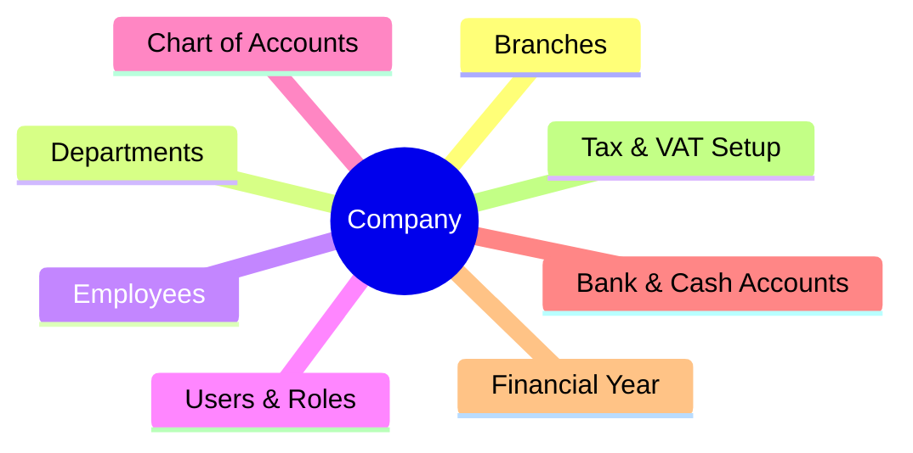
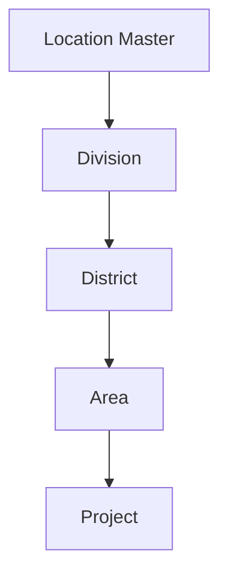
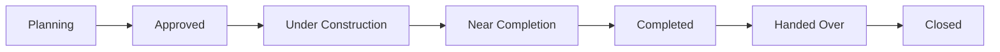

<!-- NAV_START -->
[🏠 হোম (Home)](../README.md) | [▶️ পরবর্তী (Next): Budget & BOQ Planning](./02-budget-boq-planning.md)
***
<!-- NAV_END -->

# ০১. মাস্টার ডেটা ও প্রজেক্ট সেটআপ (Master Data & Project Setup)

রিয়েল এস্টেট এবং কনস্ট্রাকশন ইআরপি (ERP) এর জন্য প্রাথমিক মাস্টার ডেটা কনফিগারেশন এবং প্রজেক্টের বেসিক সেটআপ। এই মডিউলটি পুরো ইআরপি সিস্টেমের ভিত্তি স্থাপন করে।

## ১.১. গ্লোবাল কোম্পানি সেটআপ (Global Company Setup)
সিস্টেমের কোর অর্গানাইজেশনাল স্ট্রাকচার এখানে ডিফাইন করা হবে। এই মাস্টার ডেটাগুলো একে অপরের সমান্তরালে (Parallel) কাজ করে এবং কোম্পানির মূল ভিত্তি গঠন করে:

- **কোম্পানি (Company):** মূল কোম্পানির তথ্য (নাম, লোগো, ঠিকানা, রেজিস্ট্রেশন)।
- **ব্রাঞ্চ (Branches):** বিভিন্ন শাখা বা রিজিওনাল অফিস।
- **ডিপার্টমেন্ট (Departments):** এইচআর, সেলস, প্রকিউরমেন্ট, একাউন্টস ইত্যাদি।
- **কর্মকর্তা ও কর্মচারী (Employees):** এমপ্লয়ি প্রোফাইল ও ডেটাবেস।
- **ইউজার এবং রোল পারমিশন (Users & Roles):** সিস্টেম এক্সেস কন্ট্রোল ও ডেটা সিকিউরিটি।
- **চার্ট অফ একাউন্টস (Chart of Accounts):** ফিন্যান্সিয়াল একাউন্টিং এর ভিত্তি লেজার।
- **ব্যাংক এবং ক্যাশ একাউন্ট (Bank & Cash Accounts):** কোম্পানির ফান্ড ম্যানেজমেন্টের জন্য।
- **অর্থবছর (Financial Year):** একাউন্টিং এবং বাজেটিং পিরিয়ড সেটআপ।
- **ট্যাক্স ও ভ্যাট (Tax & VAT Rules):** ম্যাটেরিয়াল ক্রয় বা কন্ট্রাক্টর বিলের জন্য টিডিএস/ভিডিএস (TDS/VDS) পারসেন্টেজ সেটআপ।

## ১.২. কোর মাস্টার্স (Core Masters)
প্রজেক্ট এবং ট্রানজেকশন পরিচালনার জন্য প্রয়োজনীয় মাস্টার ডেটা:

- **লোকেশন মাস্টার (Location Master):** `Division -> District -> Area -> Project` (হায়ারার্কিক্যাল লোকেশন ট্রি)।
- **ওয়ারহাউস ও স্টোর (Warehouses / Stores):** সেন্ট্রাল স্টোর এবং প্রজেক্ট-ভিত্তিক লোকাল সাইট স্টোর।
- **ভেন্ডর/সাপ্লায়ার (Vendors):** ম্যাটেরিয়াল সাপ্লায়ারদের প্রোফাইল ও লেজার।
- **কন্ট্রাক্টর (Contractors):** সিভিল, ইলেকট্রিক্যাল, প্লাম্বিং ইত্যাদি কাজের সাব-কন্ট্রাক্টরদের ডেটাবেস।
- **কাস্টমার/ক্লায়েন্ট (Customers):** ফ্ল্যাট/প্লট ক্রেতাদের ইনফরমেশন।
- **ম্যাটেরিয়ালস ও প্রোডাক্টস (Materials & Products):** রড, সিমেন্ট, বালি থেকে শুরু করে ফিনিশিং ম্যাটেরিয়ালের ক্যাটালগ।
- **ক্যাটাগরি ও গ্রুপ (Item Categories/Groups):** ম্যাটেরিয়ালের গ্রুপ (যেমন: সিভিল, স্যানিটারি, ইলেকট্রিক্যাল)।
- **পরিমাপের একক (Unit of Measurement - UoM):** ম্যাটেরিয়ালের একক সেটআপ (যেমন: Kg, Ton, CFT, SFT, Nos, Bag)।
- **ফিক্সড অ্যাসেট (Fixed Asset Master):** কোম্পানির নিজস্ব সরঞ্জাম ও যন্ত্রপাতি (ক্রেন, মিক্সার মেশিন, ডাম্প ট্রাক)।
- **সার্ভিস মাস্টার (Service Master):** বিভিন্ন কনসালটেন্সি ও ডিজাইনিং সার্ভিসের তালিকা।
- **এক্সপেন্স ও ইনকাম হেড (Expense & Income Heads):** একাউন্টিং লেজার ম্যাপিং।

## ১.৩. প্রজেক্ট সেটআপ (Project Setup)
প্রতিটি প্রজেক্টের জন্য একটি ইউনিক `Project ID` জেনারেট হবে, যা পুরো ইআরপি-এর ব্যাকবোন (Cost Center) হিসেবে কাজ করবে।

### প্রজেক্টের প্রাথমিক তথ্য (Project Core Info):
- Project Code & Name (যেমন: GV-001, Green Valley Residence)
- Location & Project Type (Residential / Commercial)
- **Joint Venture (JV) / Landowner Info:** বাংলাদেশের প্রেক্ষাপটে জয়েন্ট ভেঞ্চার খুবই সাধারণ। তাই জমির মালিকের তথ্য, শেয়ারিং রেশিও (যেমন: ৫০:৫০) এবং সাইনিং মানি (যদি থাকে) এখানে ট্র্যাক করতে হবে।
- Start Date & Expected End Date
- Land Cost & Estimated Construction Cost
- Total Budget
- Project Manager (Assigned Employee)

### প্রজেক্ট স্ট্রাকচার (Project Breakdown Structure):
রিয়েল এস্টেট প্রজেক্টের ডিটেইলস ট্র্যাকিং এবং সেলসের জন্য প্রজেক্টকে বিভিন্ন অংশে ভাগ করা:
- **Phase / Block / Tower:** প্রজেক্টের টাওয়ার বা ব্লক কনফিগারেশন।
- **Floor:** প্রতিটি ব্লকের ফ্লোর সেটআপ।
- **Unit / Flat:** প্রতিটি ফ্লোরের ইউনিট বা ফ্ল্যাট/কমার্শিয়াল স্পেস (Size, Facing, Rate)।

### প্রজেক্ট স্ট্যাটাস ফ্লো (Status Flow):

<!-- NAV_START -->
***
[🏠 হোম (Home)](../README.md) | [▶️ পরবর্তী (Next): Budget & BOQ Planning](./02-budget-boq-planning.md)
<!-- NAV_END -->