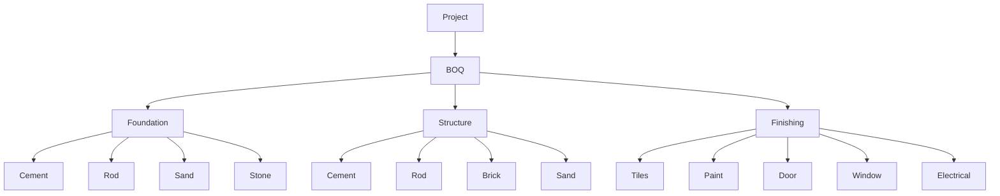
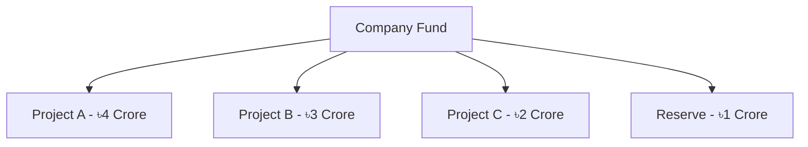

<!-- NAV_START -->
[◀️ পূর্ববর্তী (Previous): Master Data & Project Setup](./01-master-data-setup.md) | [🏠 হোম (Home)](../README.md) | [▶️ পরবর্তী (Next): Procurement, Inventory & Site](./03-procurement-inventory-site.md)
***
<!-- NAV_END -->

# ০২. বাজেট, বিওকিউ এবং ফান্ড অ্যালোকেশন (Budget, BOQ & Fund Allocation)

প্রজেক্ট শুরু হওয়ার আগে ফিন্যান্সিয়াল এবং ম্যাটেরিয়াল প্ল্যানিং নিশ্চিত করা এই মডিউলের কাজ। এটি প্রোজেক্ট কস্ট কন্ট্রোলের মূল ভিত্তি।

## ২.১. প্রজেক্ট বাজেট (Project Budget)
প্রতিটি প্রজেক্টের জন্য কস্ট হেড অনুযায়ী নির্দিষ্ট বাজেট নির্ধারণ করা হবে। এই বাজেট প্রজেক্টের লাইফসাইকেলে কস্ট ট্র্যাকিংয়ের বেঞ্চমার্ক হিসেবে কাজ করবে।
- Land Cost (ভূমি ক্রয়)
- Construction Cost (নির্মাণ ব্যয়)
- Material Cost (কাঁচামাল)
- Contractor Cost (ঠিকাদার বিল)
- Labour Cost (শ্রমিক বিল)
- Architect / Consultant Fees (আর্কিটেক্ট/পরামর্শক ফি)
- Utility Cost (বিদ্যুৎ, পানি ইত্যাদি)
- Marketing & Other Expenses (মার্কেটিং এবং অন্যান্য)

## ২.২. বিল অফ কোয়ান্টিটি (BOQ - Bill of Quantities)
কনস্ট্রাকশন ইআরপি-এর কোর ফাংশনালিটি। কাজের ফেজ অনুযায়ী প্রয়োজনীয় ম্যাটেরিয়ালের এস্টিমেশন।

- **Foundation:** Cement, Rod, Sand, Stone.
- **Structure:** Cement, Rod, Brick, Sand.
- **Finishing:** Tiles, Paint, Door, Window, Electrical Fittings.

**প্রতিটি BOQ আইটেমের প্যারামিটার:**
- Estimated Quantity
- Unit (ব্যাগ, কেজি, টন, সিএফটি)
- Estimated Rate & Amount
- Actual Quantity Consumed
- Actual Rate & Amount (বাজেট ভার্সেস অ্যাকচুয়াল ভ্যারিয়েন্স ট্র্যাকিং)

## ২.৩. প্রজেক্ট ফান্ড অ্যালোকেশন (Project Fund Allocation)
কোম্পানির সেন্ট্রাল ফান্ড থেকে নির্দিষ্ট প্রজেক্টের জন্য লিকুইড ফান্ড বা টাকা বরাদ্দ করা।

- **কোম্পানি ফান্ড:** সেন্ট্রাল ব্যাংক অ্যাকাউন্ট।
- **ফান্ড ডিস্ট্রিবিউশন:** Project A-এর জন্য X টাকা, Project B-এর জন্য Y টাকা।
- **ডিস্ট্রিবিউশন প্যারামিটার:** Date, Amount, Source Account, Purpose, Remarks.

> [!NOTE]
> **গুরুত্বপূর্ণ ব্যবসায়িক লজিক:** Budget ≠ Fund Allocation ≠ Actual Expense. 
> একটি প্রজেক্টের বাজেট হতে পারে ৫ কোটি টাকা, ফান্ড বরাদ্দ করা হতে পারে ৩ কোটি টাকা এবং বাস্তবে খরচ হতে পারে ২.২ কোটি টাকা। এই তিনটির তুলনামূলক বিশ্লেষণ ড্যাশবোর্ডে থাকতে হবে।

<!-- NAV_START -->
***
[◀️ পূর্ববর্তী (Previous): Master Data & Project Setup](./01-master-data-setup.md) | [🏠 হোম (Home)](../README.md) | [▶️ পরবর্তী (Next): Procurement, Inventory & Site](./03-procurement-inventory-site.md)
<!-- NAV_END -->