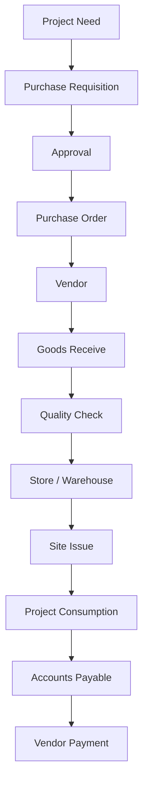
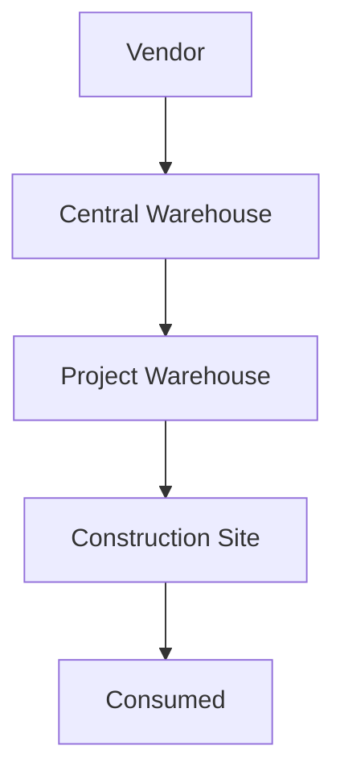

<!-- NAV_START -->
[◀️ পূর্ববর্তী (Previous): Budget & BOQ Planning](./02-budget-boq-planning.md) | [🏠 হোম (Home)](../README.md) | [▶️ পরবর্তী (Next): Contractor, Execution & Costing](./04-contractor-execution-costing.md)
***
<!-- NAV_END -->

# ০৩. প্রকিউরমেন্ট এবং ইনভেন্টরি ম্যানেজমেন্ট (Procurement & Inventory)

মালামাল ক্রয়, ওয়্যারহাউসে গ্রহণ এবং সাইটে ইস্যু সংক্রান্ত ফ্লো। ম্যাটেরিয়ালের প্রপার ট্র্যাকিং প্রজেক্টের অপচয় রোধ করতে সাহায্য করে।

## ৩.১. পারচেজ ফ্লো (Purchase Flow)
সিস্টেমে পারচেজ সাইকেলটি নিচের ধাপগুলো অনুসরণ করবে:

1. **Purchase Requisition:** প্রজেক্ট সাইট বা প্রজেক্ট ম্যানেজার থেকে ম্যাটেরিয়াল চাহিদা তৈরি (Project Need)।
2. **Requisition Approval:** অথরিটির মাধ্যমে চাহিদাপত্র অনুমোদন।
3. **Purchase Order (PO):** অনুমোদিত রিকুইজিশনের ভিত্তিতে ভেন্ডরকে পারচেজ অর্ডার প্রদান।
4. **GRN (Goods Receive Note):** সাইট বা সেন্ট্রাল ওয়্যারহাউসে ম্যাটেরিয়াল গ্রহণ ও কোয়ালিটি চেক।
5. **Accounts Payable:** ম্যাটেরিয়াল গ্রহণের পর ভেন্ডরের বিল জেনারেট এবং একাউন্টস পেয়েবল তৈরি।
6. **Vendor Payment:** একাউন্টস ডিপার্টমেন্ট থেকে ভেন্ডরকে পেমেন্ট প্রদান।

## ৩.২. ম্যাটেরিয়াল ইনভেন্টরি ফ্লো (Material Inventory Flow)
ম্যাটেরিয়াল কোথা থেকে কোথায় মুভ করছে তার রিয়েল-টাইম ট্র্যাকিং:

- **Central Warehouse:** ভেন্ডর থেকে ম্যাটেরিয়াল সেন্ট্রাল স্টোরে আসা।
- **Project Warehouse:** সেন্ট্রাল স্টোর থেকে নির্দিষ্ট প্রজেক্টের স্টোরে ট্রান্সফার।
- **Site Consumption:** সাইটে কনস্ট্রাকশন কাজের জন্য ম্যাটেরিয়াল ইস্যু এবং ব্যবহার (Consumed)।

### ইনভেন্টরি স্ট্যাটাস ট্র্যাকিং:
- মোট ক্রয়কৃত স্টক।
- প্রজেক্ট-ভিত্তিক বরাদ্দকৃত স্টক (Project Assigned Stock)।
- সাইটে ব্যবহৃত স্টক (Consumed Stock)।
- বর্তমান ব্যালেন্স স্টক।

## ৩.৩. এক্সপেন্স ফ্লো (Expense Flow)
সাইটের আনুষঙ্গিক খরচ সরাসরি প্রজেক্টের সাথে লিংক করা।
- **Expense Heads:** Transport, Electricity, Water, Labour, Office Expense, Site Expense, Marketing, Repair etc.
- প্রতিটি এক্সপেন্স নির্দিষ্ট `Project ID` এবং `Cost Center` এর আন্ডারে এন্ট্রি হবে, যাতে প্রজেক্ট-ভিত্তিক খরচ সহজে বের করা যায়।

<!-- NAV_START -->
***
[◀️ পূর্ববর্তী (Previous): Budget & BOQ Planning](./02-budget-boq-planning.md) | [🏠 হোম (Home)](../README.md) | [▶️ পরবর্তী (Next): Contractor, Execution & Costing](./04-contractor-execution-costing.md)
<!-- NAV_END -->