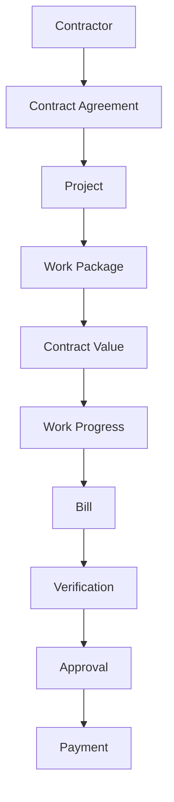
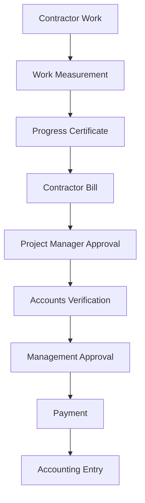
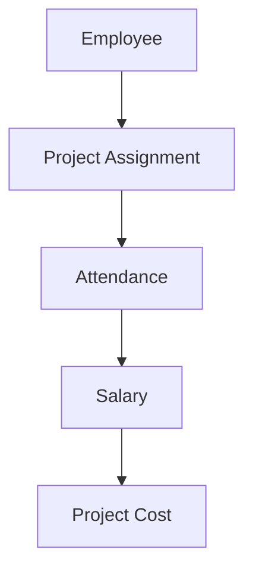
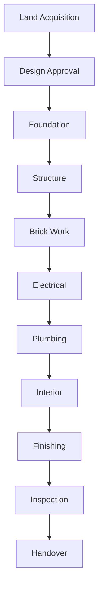

<!-- NAV_START -->
[◀️ পূর্ববর্তী (Previous): Procurement, Inventory & Site](./03-procurement-inventory-site.md) | [🏠 হোম (Home)](../README.md) | [▶️ পরবর্তী (Next): Real Estate Sales & Finance](./05-real-estate-sales-finance.md)
***
<!-- NAV_END -->

# ০৪. কন্ট্রাক্টর ম্যানেজমেন্ট এবং কস্টিং (Contractor & Execution)

কন্ট্রাক্টর দ্বারা কাজ করানো, লেবার ম্যানেজমেন্ট এবং প্রজেক্টের ফিজিক্যাল ও ফিন্যান্সিয়াল প্রগ্রেস ট্র্যাকিং।

## ৪.১. কন্ট্রাক্টর ম্যানেজমেন্ট (Contractor Management)
কন্ট্রাক্টরকে সিস্টেমের একটি আলাদা এনটিটি হিসেবে রাখা হয়।

- **Work Package / Agreement:** নির্দিষ্ট কাজের জন্য (যেমন: Foundation, Brick Work) কন্ট্রাক্টরের সাথে চুক্তি এবং Contract Value নির্ধারণ।
- **Work Progress:** কাজের কত শতাংশ (Progress %) সম্পন্ন হয়েছে তার পরিমাপ।
- **Contractor Bill Flow:**

- ফেক বা ভুল বিল রোধে এই মাল্টি-লেভেল অ্যাপ্রুভাল ফ্লো খুবই কার্যকর।

## ৪.২. লেবার ও এমপ্লয়ি কস্টিং (Labour & Employee Costing)

- **Employee Assignment:** একজন এমপ্লয়ি বা ইঞ্জিনিয়ার কোন প্রজেক্টে কতটুকু সময় দিচ্ছেন (যেমন: Project A তে ৫০%, Project B তে ৫০%), তার ভিত্তিতে তার বেতনের অংশটুকু নির্দিষ্ট প্রজেক্ট কস্টে যুক্ত হবে।
- **Daily Labour:** সাইট লেবারদের দৈনিক হাজিরা এবং মজুরি সরাসরি প্রজেক্ট কস্টের 'Labour' হেডে যুক্ত হবে।

## ৪.৩. প্রজেক্ট কস্ট ক্যালকুলেশন (Project Cost Calculation)
সব ধরনের খরচ একত্রিত করে রিয়েল-টাইম কস্ট এনালাইসিস। ইআরপি-এর মূল ইন্টেলিজেন্স এখানে কাজ করবে।
- **Actual Cost Formula:** Material Cost + Contractor Cost + Labour Cost + Employee Cost + Consultant Cost + Utility Cost + Other Expenses.
- **Cost Utilization:** Budget vs Actual Cost তুলনা করে Remaining Budget এবং Utilization % বের করা।

## ৪.৪. প্রজেক্ট প্রগ্রেস ও মাইলস্টোন (Project Milestone)
শুধু টাকা নয়, ফিজিক্যাল কনস্ট্রাকশন প্রগ্রেসও ট্র্যাক করা হবে।

- **Milestones:** Land Acquisition -> Design Approval -> Foundation -> Structure -> Brick Work -> Electrical -> Plumbing -> Finishing -> Handover.
- প্রতিটি মাইলস্টোনের জন্য: Start Date, End Date, Responsible Person, Budget, Actual Cost, Progress (%) এবং Status থাকবে।

> [!WARNING]
> যদি ফিজিক্যাল প্রগ্রেস হয় ৬০% কিন্তু বাজেট খরচ হয়ে যায় ৭৫%, সিস্টেম থেকে ম্যানেজমেন্টের জন্য ওয়ার্নিং/এলার্ট জেনারেট হতে হবে (Over Budget Risk)।

<!-- NAV_START -->
***
[◀️ পূর্ববর্তী (Previous): Procurement, Inventory & Site](./03-procurement-inventory-site.md) | [🏠 হোম (Home)](../README.md) | [▶️ পরবর্তী (Next): Real Estate Sales & Finance](./05-real-estate-sales-finance.md)
<!-- NAV_END -->