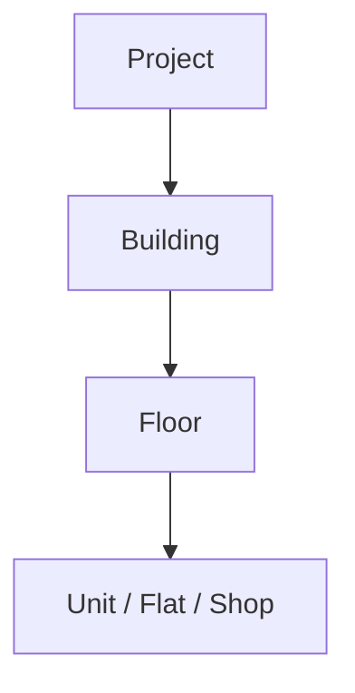
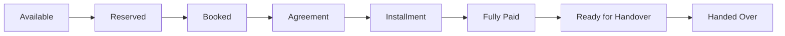
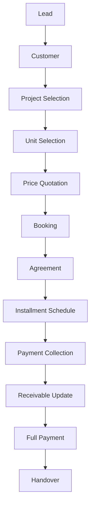
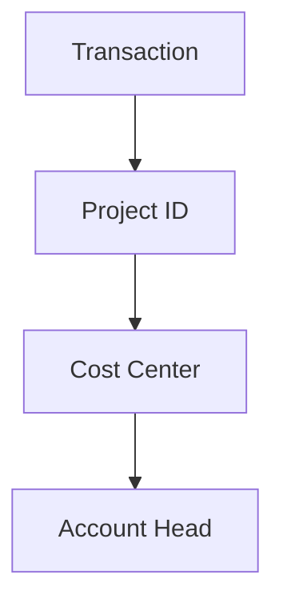

<!-- NAV_START -->
[◀️ পূর্ববর্তী (Previous): Contractor, Execution & Costing](./04-contractor-execution-costing.md) | [🏠 হোম (Home)](../README.md)
***
<!-- NAV_END -->

# ০৫. সেলস, ফিন্যান্স এবং প্রফিটেবিলিটি (Sales & Accounting)

প্রপার্টি বিক্রয়, কিস্তি আদায়, সামগ্রিক একাউন্টিং এবং প্রোজেক্টের চূড়ান্ত প্রফিট-লস এনালাইসিস।

## ৫.১. প্রপার্টি / ইউনিট ক্রিয়েশন (Unit Creation)
প্রজেক্টের আন্ডারে বিক্রিযোগ্য ইউনিটের হায়ারার্কি তৈরি করা।

- `Project` -> `Building` -> `Floor` -> `Unit / Flat / Shop`
- **ইউনিট প্যারামিটারস:** Size, Floor, Facing, Price, Status, Assigned Customer, Booking Amount, Installment Plan.
- **ইউনিট স্ট্যাটাস ফ্লো:**

## ৫.২. সেলস এবং কালেকশন ফ্লো (Customer Sales Flow)

- **Lead to Customer:** লিড ম্যানেজমেন্ট এবং কাস্টমার প্রোফাইল তৈরি।
- **Booking & Agreement:** প্রজেক্ট এবং ইউনিট সিলেক্ট করে প্রাইস কোটেশন প্রদান, বুকিং মানি গ্রহণ এবং এগ্রিমেন্ট তৈরি।
- **Installment Schedule:** কাস্টমারের সাথে চুক্তি অনুযায়ী কিস্তির সিডিউল জেনারেট করা।
- **Payment Collection:** কিস্তি আদায় এবং একাউন্টস রিসিভেবল (Accounts Receivable) আপডেট করা।
- **Handover:** সম্পূর্ণ পেমেন্ট ক্লিয়ার হওয়ার পর ফ্ল্যাট বা প্রপার্টি হস্তান্তর।

## ৫.৩. একাউন্টিং ইন্টিগ্রেশন (Accounting Hub)
ইআরপি-এর সকল মডিউল থেকে ডেটা একাউন্টিং-এ হিট করবে।

- **Cost Center:** প্রতিটি ট্রানজেকশন (Purchase, Expense, Salary) নির্দিষ্ট প্রজেক্ট আইডি (Project Cost Center)-এর সাথে যুক্ত থাকবে।
- **Purchase:** Purchase -> Accounts Payable -> Vendor Payment -> Bank/Cash.
- **Sales:** Sales -> Accounts Receivable -> Customer Payment -> Bank/Cash.
- **Expense & Contractor:** Expense/Bill -> Payable -> Payment -> Bank/Cash.

## ৫.৪. প্রজেক্ট প্রফিটেবিলিটি এবং ড্যাশবোর্ড (Project Profitability)
ম্যানেজমেন্টের জন্য সবচেয়ে গুরুত্বপূর্ণ রিপোর্ট।
- **Project Revenue (মোট আয়):** টোটাল সেলস ভ্যালু।
- **Project Cost (মোট খরচ):** কনস্ট্রাকশন ও অন্যান্য সকল খরচের যোগফল।
- **Gross Profit:** Revenue - Cost.
- **Net Profit:** Gross Profit থেকে Marketing ও Admin expense বাদ দেওয়ার পর।

### ড্যাশবোর্ড কি-মেট্রিক্স (Dashboard Key Metrics):
- Budget vs Fund Allocated vs Actual Cost
- Sales Value vs Collected vs Customer Due
- Estimated Profit & Profit Margin (%)
- Project Health Status (On Track / Over Budget Risk / Delayed)

<!-- NAV_START -->
***
[◀️ পূর্ববর্তী (Previous): Contractor, Execution & Costing](./04-contractor-execution-costing.md) | [🏠 হোম (Home)](../README.md)
<!-- NAV_END -->