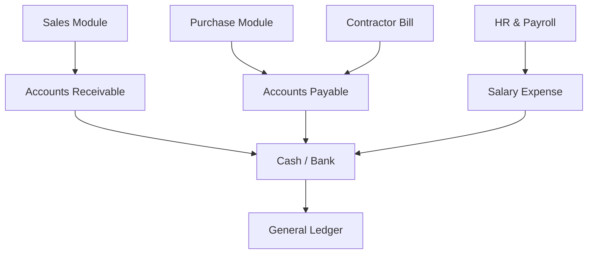

<!-- NAV_START -->
[◀️ পূর্ববর্তী (Previous): Real Estate Sales & Finance](./05-real-estate-sales-finance.md) | [🏠 হোম (Home)](../README.md) | [▶️ পরবর্তী (Next): HR, Payroll & Administration](./07-hr-payroll-administration.md)
***
<!-- NAV_END -->

# ০৬. ফিন্যান্স, একাউন্টিং এবং রিপোর্টিং (Finance, Accounting & Reporting)

ইআরপি-এর সকল মডিউলের চূড়ান্ত গন্তব্য হলো এই ফিন্যান্স ও একাউন্টিং মডিউল। সেলস, প্রকিউরমেন্ট, এইচআর—সবকিছুর ফিন্যান্সিয়াল ইমপ্যাক্ট এখানে এসে জমা হয়। 

## ৬.১. সেন্ট্রালাইজড একাউন্টিং হাব (Centralized Accounting Hub)
অন্যান্য সব মডিউল থেকে ডেটা স্বয়ংক্রিয়ভাবে একাউন্টিং লেজারে হিট করবে।

## ৬.২. প্রজেক্ট কস্ট সেন্টার (Project Cost Center)
রিয়েল এস্টেট একাউন্টিংয়ের সবচেয়ে গুরুত্বপূর্ণ দিক হলো প্রতিটি ট্রানজেকশনকে নির্দিষ্ট প্রজেক্টের সাথে যুক্ত করা।
- **Income (আয়):** কোন প্রজেক্টের কোন ফ্ল্যাট বিক্রি করে টাকা আসছে?
- **Expense (ব্যয়):** কোন প্রজেক্টের জন্য রড কেনা হলো বা লেবার বিল দেওয়া হলো?

এই ট্র্যাকিংয়ের ফলে বছর শেষে বা প্রজেক্ট শেষে নির্দিষ্ট প্রজেক্টের প্রকৃত লাভ বা ক্ষতি (Actual Profit/Loss) বের করা সম্ভব হয়।

## ৬.৩. NBR কমপ্লায়েন্স এবং ভ্যাট/ট্যাক্স (VAT & TDS Management)
বাংলাদেশ সরকারের নিয়ম অনুযায়ী (NBR Rules) ভ্যাট এবং ট্যাক্স ম্যানেজমেন্ট:
- **TDS/VDS Deduction:** ভেন্ডর পেমেন্ট এবং কন্ট্রাক্টর বিল দেওয়ার সময় স্বয়ংক্রিয়ভাবে ট্যাক্স (TDS) এবং ভ্যাট (VDS) কেটে রাখা।
- **Mushak 6.3:** ম্যাটেরিয়াল মুভমেন্ট বা প্রপার্টি হ্যান্ডওভারের সময় মূসক ৬.৩ জেনারেট করা।
- **Tax Ledgers:** সরকারের ঘরে ভ্যাট/ট্যাক্স জমা দেওয়ার জন্য ডেডিকেটেড লেজার ট্র্যাকিং।

## ৬.৪. ম্যানেজমেন্ট ড্যাশবোর্ড এবং রিপোর্টিং (Dashboard & Analytics)
ম্যানেজমেন্টের সিদ্ধান্ত নেওয়ার জন্য রিয়েল-টাইম ডেটা প্রেজেন্টেশন।

### ফিন্যান্সিয়াল রিপোর্টস (Financial Reports):
- **Trial Balance, Balance Sheet, Income Statement (Profit & Loss).**
- **Cash Flow Statement:** আগামী মাসে কত টাকা আসবে (PDC Collection) এবং কত টাকা দিতে হবে (Payables) তার ফোরকাস্ট।

### প্রজেক্ট হেলথ ড্যাশবোর্ড (Project Health Dashboard):
- **Budget vs Actual Cost:** কোন প্রজেক্টে বাজেট ওভাররান হচ্ছে তার ওয়ার্নিং।
- **Sales vs Collection:** মোট কত টাকার প্রপার্টি বিক্রি হয়েছে এবং কত টাকা কালেকশন হয়েছে।
- **Receivable Aging:** কোন কাস্টমারদের কিস্তি কতদিন ধরে ডিউ আছে।
- **Payable Aging:** কোন ভেন্ডর বা কন্ট্রাক্টর কতদিন ধরে পেমেন্ট পাচ্ছে না।

<!-- NAV_START -->
***
[◀️ পূর্ববর্তী (Previous): Real Estate Sales & Finance](./05-real-estate-sales-finance.md) | [🏠 হোম (Home)](../README.md) | [▶️ পরবর্তী (Next): HR, Payroll & Administration](./07-hr-payroll-administration.md)
<!-- NAV_END -->
