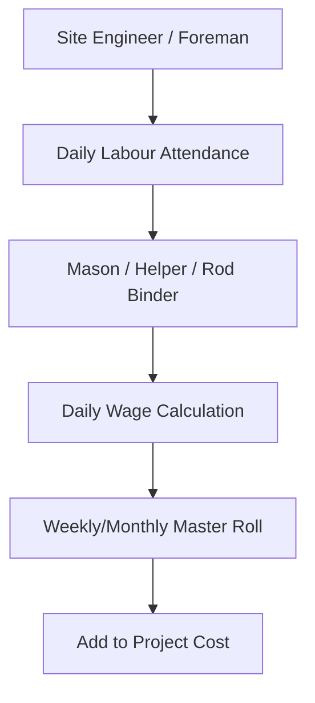

<!-- NAV_START -->
[◀️ পূর্ববর্তী (Previous): Finance, Accounting & Reporting](./06-finance-accounting-reporting.md) | [🏠 হোম (Home)](../README.md) | [▶️ পরবর্তী (Next): Legal & JV Management](./08-legal-compliance-jv-management.md)
***
<!-- NAV_END -->

# ০৭. এইচআর, পেরোল এবং অ্যাডমিনিস্ট্রেশন (HR, Payroll & Admin)

কনস্ট্রাকশন প্রজেক্টে কর্মীদের বেতন এবং দৈনিক মজুরির লেবারদের বিল ম্যানেজমেন্ট একটি গুরুত্বপূর্ণ অংশ। এই মডিউলটি এইচআর এবং সাইটের লেবারদের ডেটা সরাসরি প্রজেক্ট কস্টের সাথে যুক্ত করে।

## ৭.১. এমপ্লয়ি প্রোফাইল এবং ডেটাবেস
কোম্পানির সকল স্থায়ী এবং অস্থায়ী কর্মকর্তা-কর্মচারীদের বিস্তারিত তথ্য:
- **ব্যক্তিগত তথ্য:** নাম, পদবি, ডিপার্টমেন্ট, ব্রাঞ্চ।
- **বেতন কাঠামো (Salary Structure):** বেসিক স্যালারি, বাড়িভাড়া (House Rent), মেডিকেল অ্যালাউন্স, ট্রান্সপোর্ট ইত্যাদি।
- **ছুটি ও অ্যাটেন্ডেন্স (Leave & Attendance):** বায়োমেট্রিক মেশিনের সাথে কানেক্টেড অ্যাটেন্ডেন্স ট্র্যাকিং এবং লিভ ম্যানেজমেন্ট।

## ৭.২. প্রজেক্ট-ভিত্তিক লেবার ম্যানেজমেন্ট (Daily Labour Wages)
কনস্ট্রাকশন সাইটে কাজ করা দৈনিক মজুরির লেবারদের হিসাব রাখা।

- **Daily Attendance:** সাইট ইঞ্জিনিয়ার বা ফোরম্যান প্রতিদিন মোবাইল অ্যাপ বা পোর্টাল দিয়ে লেবারদের হাজিরা দেবে।
- **Master Roll:** সপ্তাহ বা মাস শেষে লেবারদের মাস্টার রোল (Master Roll) বা মজুরির শিট তৈরি হবে।
- **Project Linkage:** এই লেবার বিল সরাসরি ঐ নির্দিষ্ট প্রজেক্টের কস্টে (Labour Cost Head) যুক্ত হবে।

## ৭.৩. পেরোল প্রসেসিং এবং ডিস্ট্রিবিউশন (Payroll Processing)
স্থায়ী কর্মীদের মাস শেষে বেতন তৈরি করার প্রক্রিয়া।
- **Salary Sheet Generation:** অ্যাটেন্ডেন্স, ওভারটাইম (OT) এবং ডিডাকশন (যেমন: Advance, Tax) ক্যালকুলেট করে স্যালারি শিট তৈরি।
- **Cost Allocation (Salary Distribution):** একজন ইঞ্জিনিয়ার যদি ২টি আলাদা প্রজেক্টে সময় দেন (যেমন প্রজেক্ট-এ তে ৬০%, প্রজেক্ট-বি তে ৪০%), তবে তার বেতনের টাকা সেই অনুযায়ী দুই প্রজেক্টের খরচে ভাগ হয়ে যাবে।
- **Payment Disbursement:** একাউন্টস ডিপার্টমেন্টের মাধ্যমে ব্যাংক বা ক্যাশে স্যালারি প্রদান।

## ৭.৪. অ্যাডমিনিস্ট্রেশন এবং অন্যান্য সুবিধা (Administration)
- **Employee Advance & Loan:** কর্মীদের অগ্রিম বেতন বা লোন দেওয়া এবং তা কিস্তিতে স্যালারি থেকে কাটা।
- **Vehicle & Transportation:** কোম্পানির নিজস্ব গাড়ির লগবুক মেইনটেইন, ফুয়েল ট্র্যাকিং এবং গাড়িগুলো কোন প্রজেক্টে কতটুকু ব্যবহার হচ্ছে তার কস্টিং বের করা।

<!-- NAV_START -->
***
[◀️ পূর্ববর্তী (Previous): Finance, Accounting & Reporting](./06-finance-accounting-reporting.md) | [🏠 হোম (Home)](../README.md) | [▶️ পরবর্তী (Next): Legal & JV Management](./08-legal-compliance-jv-management.md)
<!-- NAV_END -->
